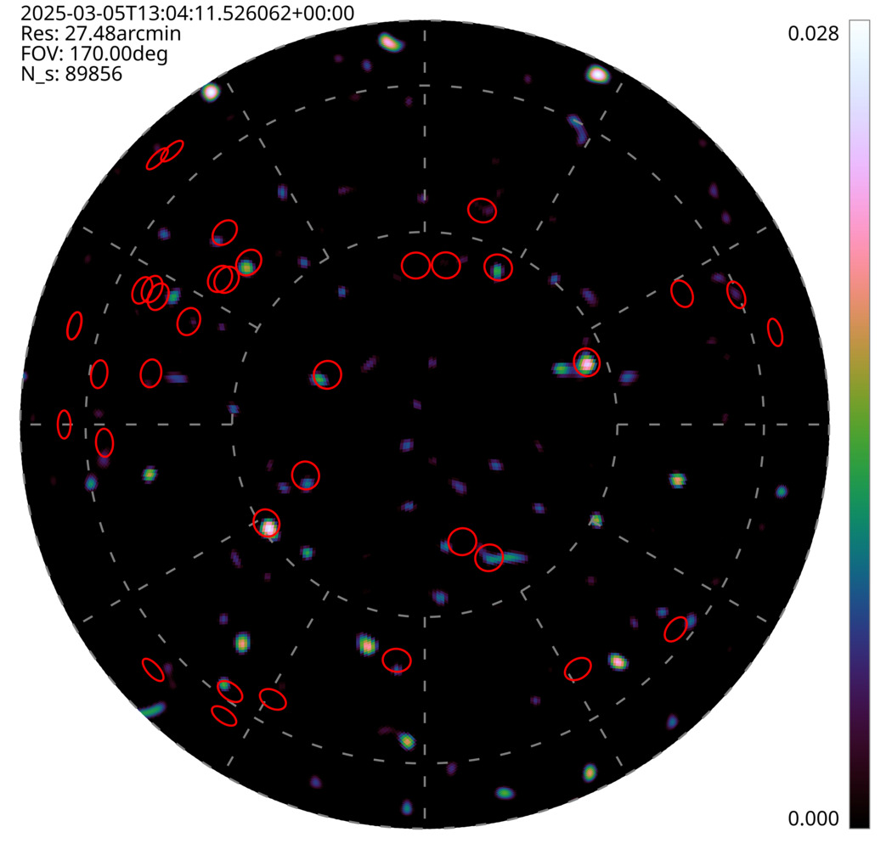

# TART telescope tools

Containerized tools for using the TART radio telescope. This repository creates a TART tools container. It is recommended that this container be used using apptainer (or singularity) which requires Linux or recent versions of Windows. They can also be used with docker on all platforms (but some filesystem mounting is required).

The tools available are:

* [tart2ms](https://github.com/tart-telescope/tart2ms): Create and manipulate measurement sets from TART data
* [disko](https://github.com/tmolteno/disko): Discrete Sky Operator imaging. Ideal for working with wide-field TART data.
* disko_draw: Draw and visualize discrete fields of view
* [spotless](https://github.com/tmolteno/spotless): Model fitting imaging direct from visibilities. Create a sky model direct from visibilities. 
* All of the [tart_tools](https://github.com/tmolteno/tart_modules/tree/main/tart_tools) python package.
* * tart_download_data
* * tart_upload_antenna_positions etc.

## Build The Tools

Currently the tools require [apptainer/singularity](https://apptainer.org/) to be installed, do this on your system, and then

    make build

### Create an alias called tart_tools

    alias tart_tools='apptainer run /home/tim/tart-telescope/tools/tart_tools.sif'

## Using tart_tools

The tart_tools alias allows each tool to be run. See the following example:

First download some data

    tart_tools tart_download_data --vis --api https://api.elec.ac.nz/tart/mu-udm --n 1

Then convert that data to a measurement set (tart2ms)

    tart_tools tart2ms --hdf vis_2025-03-05_13_04_41.765325.hdf --single-field --rephase obs-midpoint --ms udm.ms
    
Then image the data using l1 regularization (disko)

    tart_tools disko --ms udm.ms --nvis 10000 --healpix --fov 170deg --res 30arcmin  --lasso --alpha 0.005 --HDF tart_udm_image.h5

Finally draw the known sources on the image and write it out as an SVG:

    tart_tools disko_draw --show-sources --SVG tart_udm_image.svg tart_udm_image.h5

Then convert the image to a JPG.

    convert -resize 25% tart_udm_image.svg img/tart_udm_image.jpg
    

## Building

For the moment, you can build locally. The command

    make build

Will create an apptainer application tart_tools.sif that can run any of the commands.

## ToDo

* Put the container on docker hub.

## Changelog

* March 2025. Initial commit.
